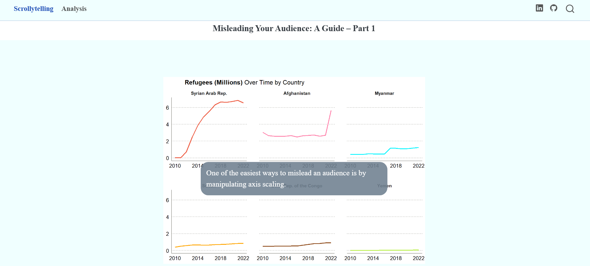

### Scrollytelling Project: Misleading Your Audience: A Guide – Part 1

View [Scrollytelling Project](https://darakhshannehal.quarto.pub/scrollytelling/)



Built with **Quarto**, **Closeread** extension, and **R**, this project serves as an educational example of how visual choices in data presentation can significantly influence the audience's perception and understanding of the underlying information. It specifically focuses on the impact of **y-axis scaling** in **time-series** visualizations.

#### Data: UNHCR's refugees R package

### R packages used:
- tidyverse
- ggplot2
- refugees

### Closeread Setup 
#### To add Closeread to your own Quarto project:
```
quarto add qmd-lab/closeread
```
